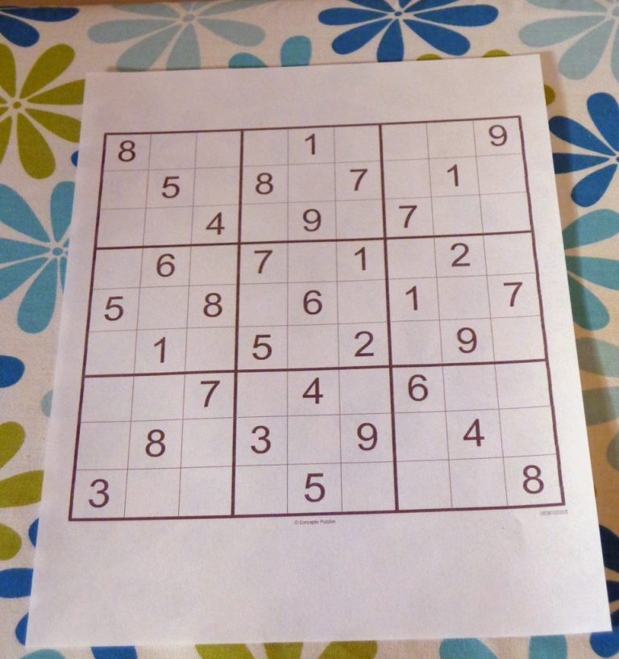
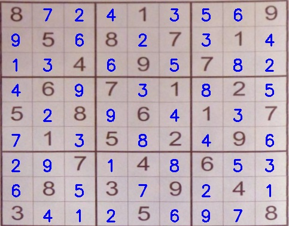

# Image-Based Sudoku Solver
Solve Sudoku puzzles from images using OCR and Computer Vision techniques.

## Workflow Overview
1. Input an image containing a Sudoku puzzle.
2. Detect and extract the Sudoku board from the image.
3. Segment the board into individual cells (typically a 9×9 grid).
4. Identify digits in the cells using OCR.
5. Solve the puzzle using a Sudoku-solving algorithm.
6. Display the solved puzzle to the user.

* Steps 1–3 utilize OpenCV and other image processing libraries.
* OCR is performed using a Deep Learning CNN model, SudokuNet, trained with Keras and TensorFlow.
* The **Dataset** for training is a subset of the [Chars74K image dataset](http://www.ee.surrey.ac.uk/CVSSP/demos/chars74k/).
* The puzzle is solved using a backtracking algorithm.
* The code is thoroughly documented with comments for clarity.

#### Check out my repository for solving Sudoku puzzles using the backtracking algorithm: :point_right: [Sudoku Solver Backtracking](https://github.com/GaneshSparkz/Sudoku-Solver-Backtracking)

## How to Run the Code
### 1. Clone the Repository
```Shell
git clone https://github.com/GaneshSparkz/OCR-Sudoku-Solver.git
```

### 2. Navigate to the Project Directory
```Shell
cd OCR-Sudoku-Solver
```

### 3. Install Dependencies
```Shell
pip install -r requirements.txt
```

### 4. Execute the Solver
```Shell
python solve_sudoku.py -m trained_model/digit_classifier.h5 -i sudoku.jpg
```
To visualize the process, enable the debug flag:
```Shell
python solve_sudoku.py -m trained_model/digit_classifier.h5 -i sudoku.jpg -d 1
```
Command-line arguments:
```Shell
usage: solve_sudoku.py [-h] -m MODEL -i IMAGE [-d {0,1}]

optional arguments:
  -h, --help            show this help message and exit
  -m MODEL, --model MODEL
                        path to the trained digit classifier model
  -i IMAGE, --image IMAGE
                        path to the image containing the sudoku puzzle
  -d {0,1}, --debug {0,1}
                        set to 1 to visualize each step of the process
                        (default: 0)
```
**The pre-trained model (.h5 file) is available in the `trained_model/` directory.**

### 5. Output
Input Image:



```Shell
Using TensorFlow backend.
[INFO] loading digit classifier...
[INFO] processing image...
[INFO] The recognized Sudoku board...
+-----------------------+
| 8     |   1   |     9 |
|   5   | 8   7 |   1   |
|     4 |   9   | 7     |
+-----------------------+
|   6   | 7   1 |   2   |
| 5   8 |   6   | 1   7 |
|   1   | 5   2 |   9   |
+-----------------------+
|     7 |   4   | 6     |
|   8   | 3   9 |   4   |
| 3     |   5   |     8 |
+-----------------------+
[INFO] solving the sudoku puzzle...
[INFO] solved...
[INFO] Sudoku board after solving...
+-----------------------+
| 8 7 2 | 4 1 3 | 5 6 9 |
| 9 5 6 | 8 2 7 | 3 1 4 |
| 1 3 4 | 6 9 5 | 7 8 2 |
+-----------------------+
| 4 6 9 | 7 3 1 | 8 2 5 |
| 5 2 8 | 9 6 4 | 1 3 7 |
| 7 1 3 | 5 8 2 | 4 9 6 |
+-----------------------+
| 2 9 7 | 1 4 8 | 6 5 3 |
| 6 8 5 | 3 7 9 | 2 4 1 |
| 3 4 1 | 2 5 6 | 9 7 8 |
+-----------------------+
```
Solved Puzzle:



### Training the Model
1. Download the dataset: :point_right: [Dataset](https://drive.google.com/file/d/1ysIQhQB8NT6nVkaO0FAr4BU1oOOhvZlR/view?usp=sharing)
2. Extract the dataset and place it in the project directory.
3. Modify the model architecture in **utils/model.py** if needed.
4. Adjust hyperparameters in **train.py**:
  * Lines 24–27:
```Python
LR = 1e-3
EPOCHS = 10
BATCH_SIZE = 50
STEPS_PER_EPOCH = 2000
```
  * Lines 69–75:
```Python
data_gen = ImageDataGenerator(
    width_shift_range=0.1,
    height_shift_range=0.1,
    rotation_range=10,
    shear_range=0.1,
    zoom_range=0.2
)
```

5. Train the model:
```Shell
python train.py -o trained_model/digit_classifier.py
```
Command-line arguments:
```Shell
usage: train.py [-h] -o OUTPUT

optional arguments:
  -h, --help            show this help message and exit
  -o OUTPUT, --output OUTPUT
                        path to save the trained model file
```

